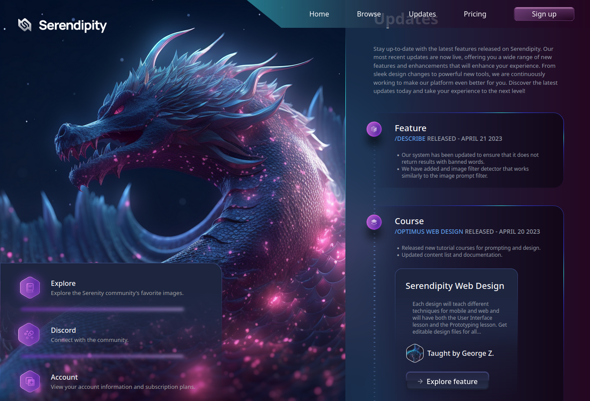
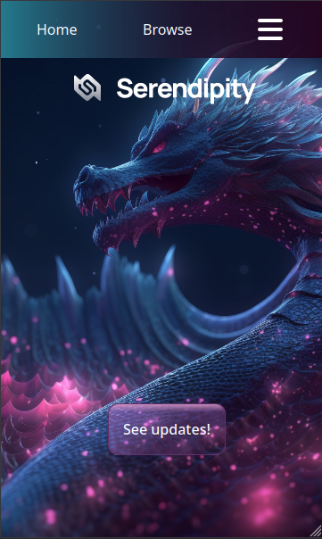
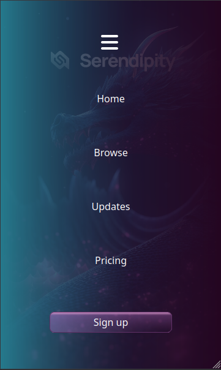
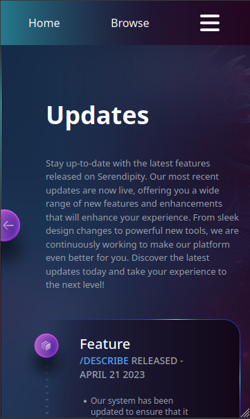

# Frontend Challenge - Serendipity



<div>
  
  
  
</div>

## Overview

This repository contains my solution for a frontend challenge where I decided to bring to life a beautiful Figma design by creating a web page using React, Tailwind CSS, and CSS. The challenge was an exciting opportunity to demonstrate my frontend development skills and attention to detail in translating a static design into an interactive and responsive web application.

## Table of Contents

- [Frontend Challenge - Serendipity](#frontend-challenge---serendipity)
  - [Overview](#overview)
  - [Table of Contents](#table-of-contents)
  - [Design Inspiration](#design-inspiration)
  - [Technologies Used](#technologies-used)
  - [Features](#features)
  - [Installation and Setup](#installation-and-setup)
  - [Usage](#usage)
  - [Contributing](#contributing)
  - [License](#license)
  - [Acknowledgments](#acknowledgments)

## Design Inspiration

The project began with stumbling upon a visually stunning Figma design, which instantly captivated my attention. The intricate details and creative layout motivated me to take on the challenge of turning this static design into a fully functional web page.


## Technologies Used

The project was built using the following technologies:

- React: A popular JavaScript library for building user interfaces, allowing for the creation of reusable components and smooth rendering.
- Tailwind CSS: A utility-first CSS framework that enabled me to rapidly style the components with minimal custom CSS.
- CSS: In addition to Tailwind CSS, I used CSS to fine-tune specific elements and add custom styles to achieve pixel-perfect alignment.

## Features

The completed web page boasts the following features:

- Responsive Design: The web page is fully responsive, adapting elegantly to various screen sizes and devices.
- Interactive Elements: I implemented interactive elements like buttons, sliders, and dropdowns to enhance the user experience.
- Image Optimization: Images were optimized for fast loading and improved performance.
- Cross-Browser Compatibility: The web page is compatible with major web browsers, ensuring a consistent experience for all users.

## Installation and Setup

To run this project locally, follow these steps:

1. Clone this repository to your local machine using `git clone https://github.com/zivic/frontend-challenge-1.git`.
2. Navigate to the project directory: `cd frontend-challenge-1`.
3. Install the necessary dependencies by running `npm install`.

## Usage

To start the development server and view the web page, run the following command:

```bash
npm start
```

Open your web browser and go to `http://localhost:3000` to see the web page in action.

## Contributing

Contributions are welcome! If you'd like to contribute to the project, please follow the standard GitHub flow:

1. Fork the repository.
2. Create a new branch with a descriptive name: `git checkout -b feature/your-feature-name`.
3. Commit your changes: `git commit -m 'Add some feature'`.
4. Push the branch to your forked repository: `git push origin feature/your-feature-name`.
5. Submit a pull request to the main repository.

## License

This project is licensed under the [MIT License](LICENSE).

## Acknowledgments

I would like to express my gratitude to , the creator of the Figma design that served as the inspiration for this project. Additionally, I appreciate the supportive developer community for their valuable insights and resources.

Thank you for exploring my Frontend Challenge! If you have any questions or feedback, feel free to reach out. Happy coding!
